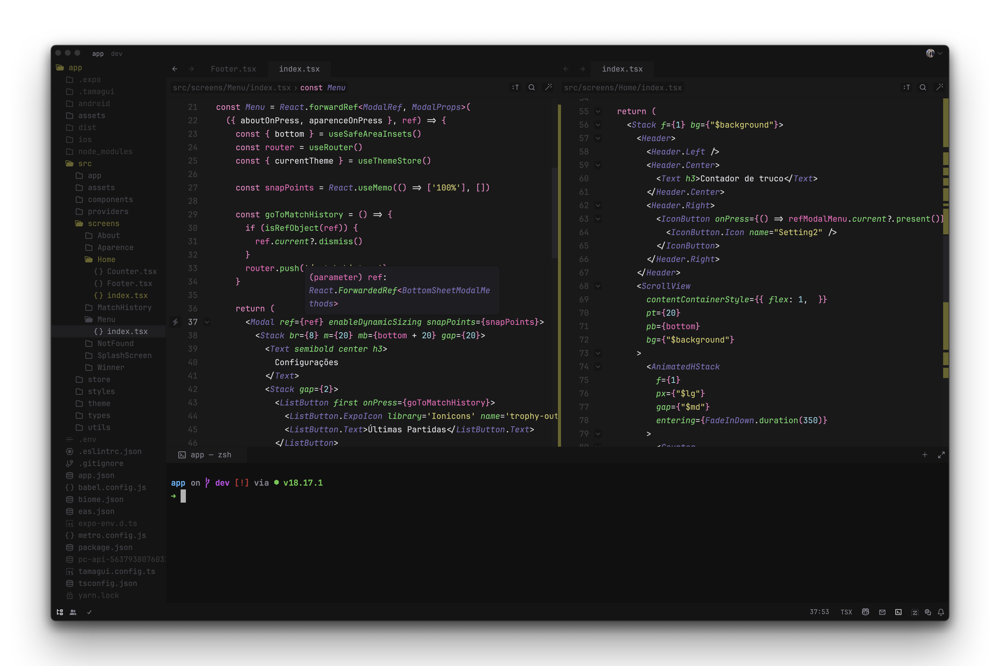

<h3 align="center">
	ZedSpace for <a href="https://zed.dev/">Zed</a>
</h3>




<!-- ## Usage
1. Create the theme folder if it doesn't already exist:
	```bash
	mkdir -p ~/.config/zed/themes/
	```
2. Execute the command to download the theme:
   ```bash
   curl -o ~/.config/zed/themes/zedspace.json https://raw.githubusercontent.com/brunowilliang/zedspace/main/zedspace.json
   ```

3. Open Zed
4. Open the command palette
5. Open the theme selector and search for ZedSpace
6. Enjoy 🚀
 -->

&nbsp;
## 🚀 Created by

🧑🏼‍💻 [Bruno Garcia](https://github.com/brunowilliang)

&nbsp;

## 🚀 Follow me
[Twitter](https://twitter.com/Brunowgarcia)
&nbsp;
[LinkedIn](https://linkedin.com/in/brunowilliang)
&nbsp;
[Instagram](https://www.instagram.com/brunowilliang)

&nbsp;

<p align="center">
	Copyright &copy; 2024-present <a href="https://github.com/brunowilliang" target="_blank">Bruno Garcia</a>
</p>

<p align="center">

</p>
